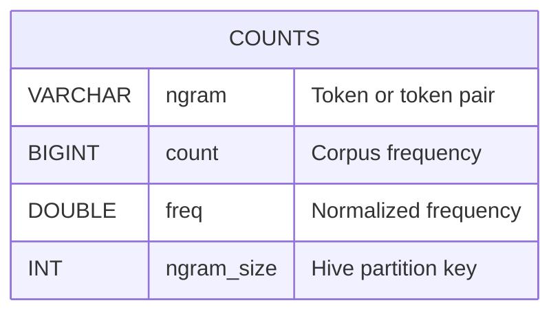

# Example — Book N-gram Counts

A simplified pipeline inspired by a real Wikipedia n-gram workflow. It shows
the patterns the skill must handle: Snakemake with parameter variants,
profiling data from a skills directory, schema diagrams, and step-level
documentation.

## Input: Snakefile

```python
configfile: "config.yaml"

NGRAM_SIZES = [1, 2]

rule all:
    input:
        expand("output/ngram_size={n}/counts.parquet", n=NGRAM_SIZES)

rule download:
    output: "data/books.jsonl"
    shell: "curl -sL {config[url]} > {output}"

rule tokenize:
    input: "data/books.jsonl"
    output: "scratch/ngram_size={n}/tokens.parquet"
    params:
        min_count = lambda wc: 5 if int(wc.n) == 1 else 10
    resources:
        mem_mb = lambda wc: 8000 if int(wc.n) == 1 else 16000
    shell: "python scripts/tokenize.py {input} {output} --ngram {wildcards.n} --min-count {params.min_count}"

rule aggregate:
    input: "scratch/ngram_size={n}/tokens.parquet"
    output: "output/ngram_size={n}/counts.parquet"
    shell: "python scripts/aggregate.py {input} {output}"
```

## Input: config.yaml

```yaml
url: "https://example.com/books.jsonl"
```

## Input: profiling data

Found at `.claude/skills/duckdb-slurm-hpc/experiments/README.md`:

```markdown
| Step      | Variant | Wall Time | Peak RSS |
|-----------|---------|-----------|----------|
| tokenize  | 1-gram  | 12s       | 6.2 GB   |
| tokenize  | 2-gram  | 45s       | 14.1 GB  |
| aggregate | 1-gram  | 3s        | 1.1 GB   |
| aggregate | 2-gram  | 8s        | 2.3 GB   |
```

---

## Expected output: PIPELINE.md

```markdown
# PIPELINE.md — Book N-gram Counts

> Auto-generated by the pipeline-summarizer skill. Do not edit manually.
> Generated: 2026-05-05
> Source: https://github.com/example/book-ngrams

---

## Plain-Language Summary

This pipeline downloads a corpus of book texts, tokenizes them into unigrams
and bigrams, and aggregates token frequencies into Hive-partitioned Parquet
files. The outputs are useful for lexical trend analysis and language modeling
benchmarks. Bigrams use stricter filtering (min_count=10) and require more
memory than unigrams.

---

## Pipeline Overview

- **Orchestrator:** Snakemake
- **Entry point:** `Snakefile`
- **Language:** Python
- **Environment:** System Python
- **Execution context:** Local

---

## External Resources

| Resource | Type | Location / URL | Notes |
|---|---|---|---|
| Book corpus | Dataset | `https://example.com/books.jsonl` | Fetched at build time |

---

## Resource Consumption

| Step | Variant | Wall Time | Peak RSS |
|---|---|---|---|
| Tokenize | 1-gram | 12s | 6.2 GB |
| Tokenize | 2-gram | 45s | 14.1 GB |
| Aggregate | 1-gram | 3s | 1.1 GB |
| Aggregate | 2-gram | 8s | 2.3 GB |
| **Total** | **1-gram** | **~15s** | **6.2 GB** |
| **Total** | **2-gram** | **~53s** | **14.1 GB** |

Source: `.claude/skills/duckdb-slurm-hpc/experiments/README.md`

---

## Reproducibility Notes

- **Pinned versions:** no
- **Random seeds:** not applicable
- **Known limitations:** corpus URL may change
- **How to rerun:** `snakemake --cores 4`

---

## Step 1 — Download Corpus

- **Script:** inline shell
- **Rule:** `download`
- **Input(s):**
  - `config[url]` — remote JSONL corpus
- **Output(s):**
  - `data/books.jsonl` — one JSON object per book

## Step 2 — Tokenize

- **Script:** `scripts/tokenize.py`
- **Rule:** `tokenize`
- **Input(s):**
  - `data/books.jsonl`
- **Output(s):**
  - `scratch/ngram_size={n}/tokens.parquet` — per-token counts
- **Filters applied:**
  - `min_count`: 5 (unigrams), 10 (bigrams) — drops rare tokens
- **Key parameters:**
  - `mem_mb`: 8 GB (unigrams), 16 GB (bigrams)
- **Notes:** bigrams require 2× memory due to combinatorial token pairs.

## Step 3 — Aggregate

- **Script:** `scripts/aggregate.py`
- **Rule:** `aggregate`
- **Input(s):**
  - `scratch/ngram_size={n}/tokens.parquet`
- **Output(s):**
  - `output/ngram_size={n}/counts.parquet` — final frequency table

---

## Dataset Schema Diagram



## Pipeline Overview Diagram


```
